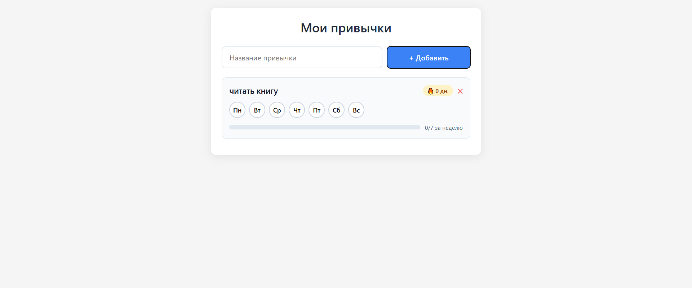

# Трекер привычек

Современное веб-приложение для формирования и отслеживания полезных привычек.



🔗 GitHub Pages:  
https://saiddavletmurzaev91-boop.github.io/comp-store/
## Возможности

- Добавление новых привычек
- Отметка выполнения за день
- Автоматический расчёт серии (streak)
- Прогресс выполнения за неделю
- Адаптивный дизайн (работает на телефоне и компьютере)
- Сохранение данных в localStorage браузера

## Технологии

- HTML5
- CSS3 (Flexbox + Grid)
- Vanilla JavaScript (без фреймворков)
- localStorage

## Как запустить проект локально

1. Скачайте проект:
   ```bash
   git clone https://github.com/Blech06/habit-tracker.git
